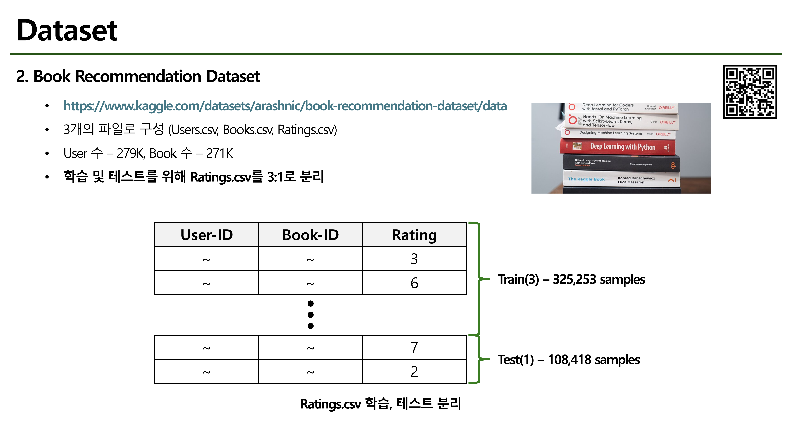
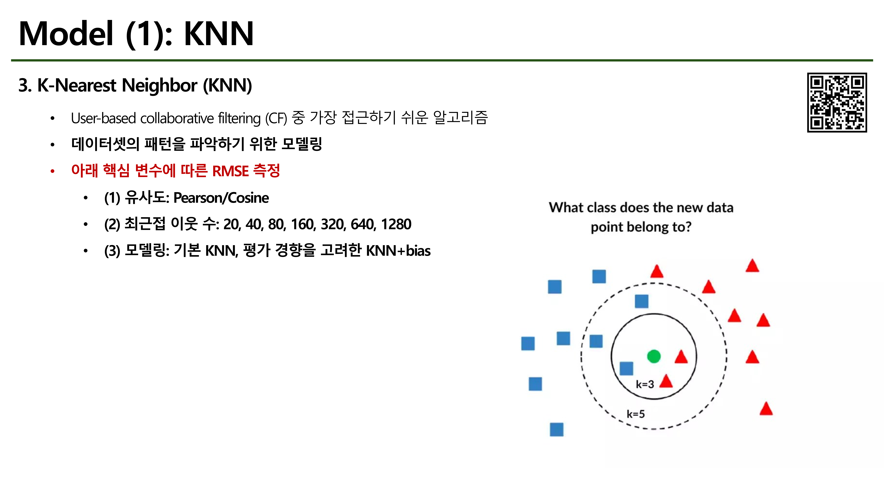
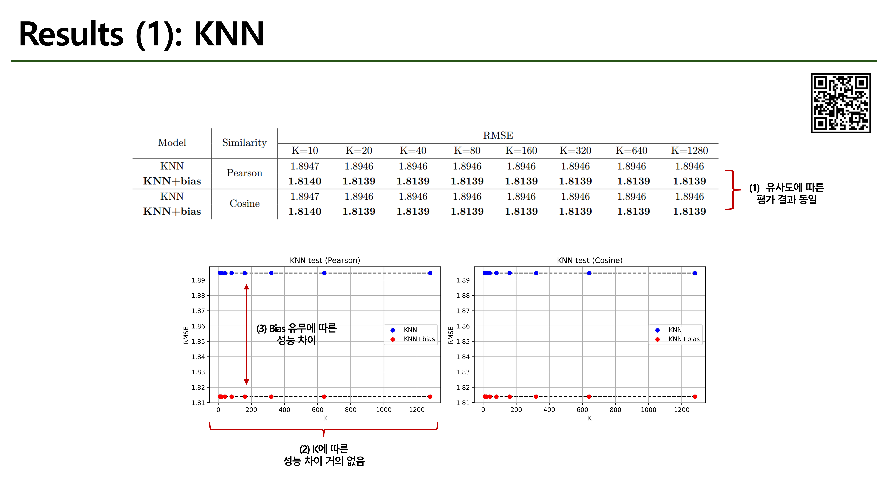
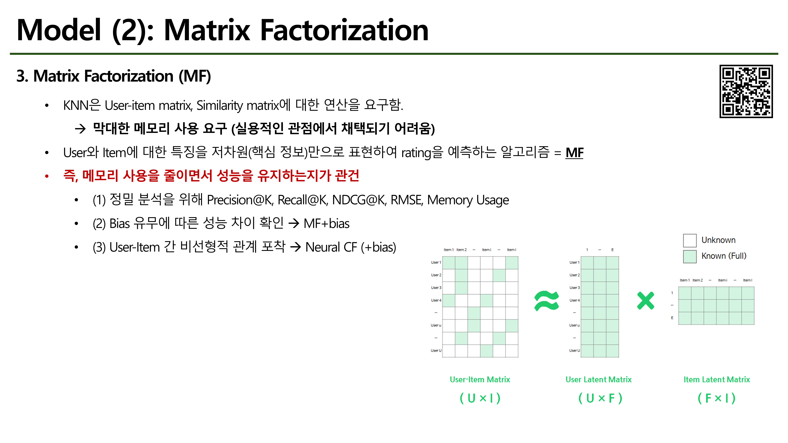
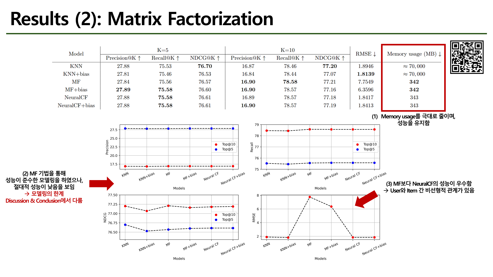
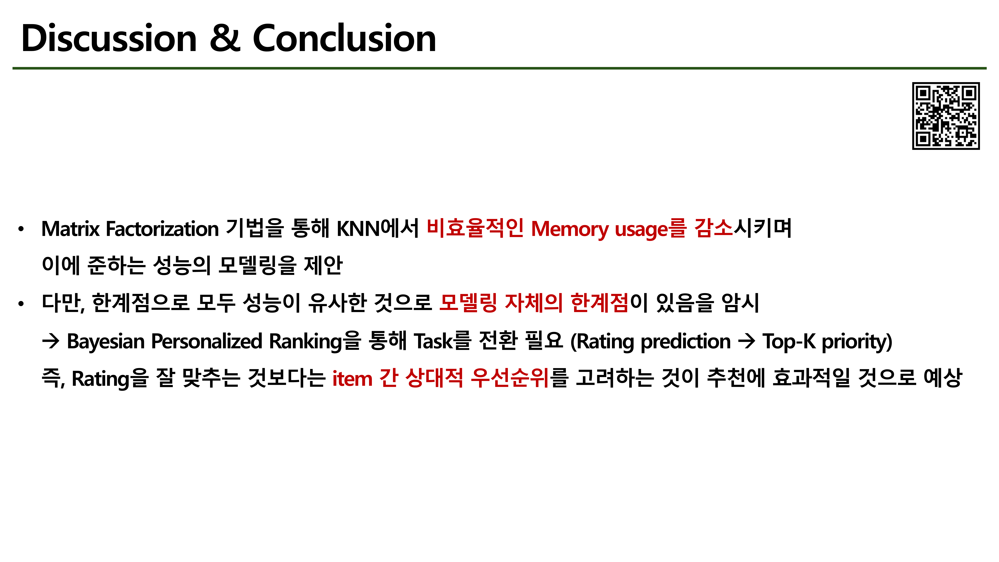

# AI추천시스템 TermProject
* IT융합학부 20202086 권다운
* Collaborative Filtering 기반 도서 추천시스템 <b>(KNN, Matrix Factorization, Neural Collaborative Filtering)</b>
* [PPT Slide 보기](#Slides)

# Dataset
* Download here! <a href="https://www.kaggle.com/datasets/arashnic/book-recommendation-dataset/data">Kaggle Book Recommendation Dataset</a>

# Environments
```
# Clone this repository
git clone https://github.com/drawcodeboy/RecommenderSystem-TermProject.git .

# If you use Surprise,
conda create -n rec_sur python=3.9
conda activate rec_sur
conda install -c conda-forge scikit-surprise
pip install jupyter
pip install pandas
pip install scikit-learn
pip install matplotlib

# If you use PyTorch
conda create -n recom python=3.12
conda activate recom
pip install -r requirements.txt
```
# Executions
```
# Training
python train.py --config=mf.book
python train.py --config=mf_bias.book
python train.py --config=ncf.book
python train.py --config=ncf_bias.book
python train.py --config=ncf_bias_bpr.book # unable to train yet

# Test
python test.py --config=mf.book
python test.py --config=mf_bias.book
python test.py --config=ncf.book
python test.py --config=ncf_bias.book
python test.py --config=ncf_bias_bpr.book # unable to test yet

# Recommend
python subtasks/03_recommender/exec.py # 277171, Best user case
```

# Slides
<table align="center">
  <tr>
    <td align="center">
      <br>
      <br>
      <br>
      <br>
      <br>
      <br>
      <br>
      <br>
      <br>
    </td>
  </tr>
</table>

